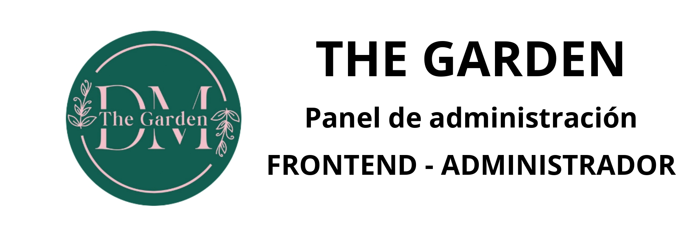

<h1 style="text-align:center;">THE GARDEN - ADMINISTRADOR</h1>




Esta aplicacion funciona para el control, envio de notificaciones, recibo de ordenes de clientes, gestionando la entrega, cuenta funciones para que pueda vizualizar lo que comentan.

## Recursos usados

- [Angular CLI](https://github.com/angular/angular-cli) version 20.3.5.
- [NODE JS](https://nodejs.org/es) version 22.16.0
- [PRIMENG](https://primeng.org/) version 20

## Complementos de app

- [CLIENTE - APP MOVIL](https://github.com/JHuancaDev/flutter_restaurante.git)
- [SERVIDOR](https://github.com/JHuancaDev/back-restaurante.git)

## Instalacion local

Clonar repositorio

```bash
git clone https://github.com/JHuancaDev/f-restaurante.git
```

Instalar dependencias

```bash
npm install
```

Ejecutar 

```bash
ng serve -o
```

Ingresar en navegador

```bash
http://localhost:4200/
```
## Desarrollador por:
- [JHuancaDev](https://github.com/JHuancaDev)